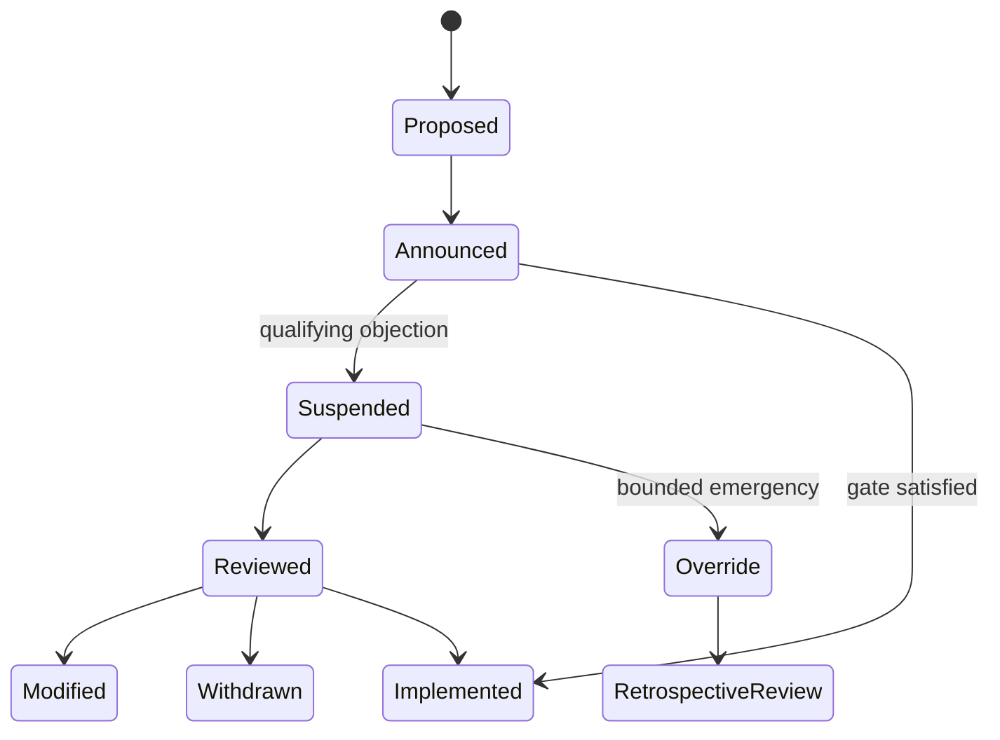

# Edge-triggered suspension

A qualifying objection can pause effect admission before consequences make a knowledge failure visible. Adopters configure eligible objectors, threshold, objection window, suspension period, review authority, emergency override, and retrospective review.

Thresholds are profile parameters, not universal constants.
