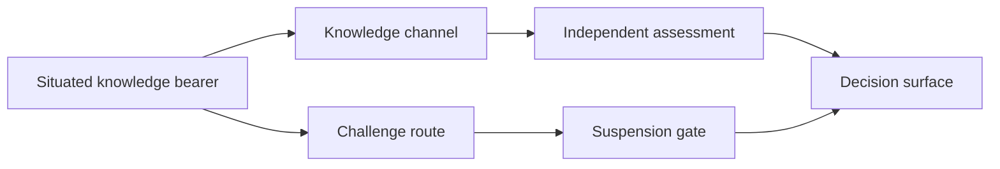

# Knowledge paths

A knowledge path is the governed route through which relevant situated knowledge can reach a decision surface. It identifies the knowledge dependency, knowledge-bearing actor class, transmission channel, receiving authority, challenge mechanism, validity period, and evidence produced.

A valid path must preserve an unanticipated-input channel. A survey or fixed taxonomy may collect expected answers while filtering out the facts the authority did not know to request.

