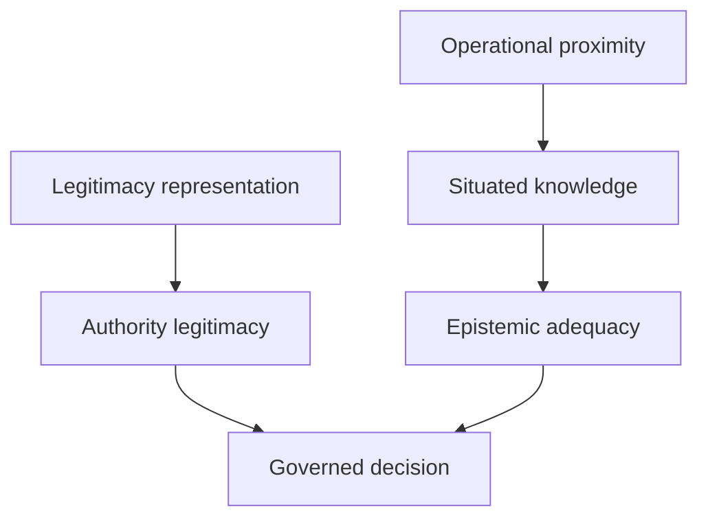

# Representation and proximity

Representation can establish constituency legitimacy. Expertise can establish subject competence. Neither proves current operational proximity. The overlay therefore requires separate evidence for representation basis, proximity, knowledge transmission, coverage limitations, and a non-substitution attestation.

