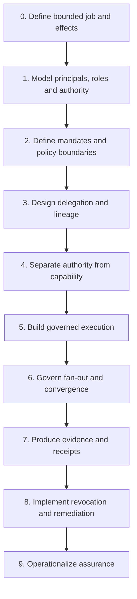

# Agentic Systems Architecture and Governance Implementation Guide

**A field-ready method for designing bounded, verifiable, and governable systems of agents that deliver a job.**

This guide is for enterprise architects, solution architects, governance engineers, security architects, assurance leads, consultants, and product teams. It converts three coordinated bodies of work into a practical delivery method:

- **Trust Systems Meta-Model (TSMM)** supplies the semantic model for principals, roles, authority, policy, decisions, evidence, effects, lifecycle, and delegation topology.
- **Trust Infrastructure Schemas (TIS)** supplies portable machine-readable contracts and validation boundaries.
- **Trust Graph Artifacts (TGA)** supplies executable governance patterns, threats, controls, assurance cases, receipts, and negative tests.

The implementation target is not a generally autonomous agent. It is a **bounded job** whose consequential effects enter the world through legitimate authority, constrained delegation, least-privilege capabilities, governed execution, and verifiable evidence.

> **Design objective:** Every consequential effect is attributable to an identifiable role, produced under current and bounded authority, through an intact delegation chain, using a least-privilege capability, after applicable policy checks, with evidence sufficient for audit, challenge, revocation, and remediation.

## Choose a starting path

| Your need | Start here |
|---|---|
| Design a first governed job | [Implementation guide]() |
| Run a consulting or architecture engagement | [Adoption checklist]() |
| Map controls to repository artifacts | [Repository crosswalk]() |
| Define required architecture decisions | [Architecture decisions]() |
| Build a test and assurance plan | [Assurance and testing]() |
| Assess current maturity | [Maturity model]() |
| Copy implementation artifacts | [Templates]() |
| Follow a complete example | [Supplier assessment]() |

## Delivery sequence

Each stage specifies entry criteria, steps, outputs, repository references, tests, evidence, common failure modes, and an exit gate.

## Four planes of a governed agentic system

The guide distinguishes four architectural planes so that discovery, permission, execution, and proof cannot collapse into one another.

| Plane | Governing question | Typical responsibilities |
|---|---|---|
| Discovery | Who or what exists and how can it be located? | registration, identifiers, metadata, lifecycle, resolution |
| Authority control | May this actor cause this effect, for this principal, now? | mandates, delegation, scope, policy, recognition, revocation |
| Execution | How is an admitted job actually performed? | orchestration, tools, capabilities, enforcement points, effects |
| Evidence and assurance | What proves the previous three planes behaved correctly? | receipts, provenance, assessment, reconstruction, challenge |

A system may implement these planes with different protocols or components. The guide does not require a particular registry, agent transport, orchestration framework, or model runtime.

## Agent Registry Protocol alignment

The [Agent Registry Protocol (ARPA)](https://github.com/sankarshanmukhopadhyay/agent-registry-protocol) is a **concrete protocol realization of selected discovery, authority-control, lifecycle, federation, and evidence responsibilities described by this guide**. ARPA is an optional implementation alignment, not a dependency of the guide.

ARPA's modular architecture maps naturally to the guide:

| Guide responsibility | ARPA realization |
|---|---|
| persistent agent identity, lifecycle, discovery and historical resolution | ARPA-Core |
| principal/operator and other typed relationships | ARPA-Relations |
| capability declarations, verification and scoped assurance | ARPA-Assurance |
| delegation, conditions, prohibitions and authority decisions | ARPA-Authority |
| execution receipts, reconstruction, retention and audit | ARPA-Evidence |
| external governance-domain recognition and withdrawal | ARPA-Federation |

The shared invariants are more important than shared vocabulary. In particular:

- discovery does **not** imply authorization;
- authentication does **not** imply authority;
- registration does **not** imply permission to act;
- capability does **not** imply legitimate authority;
- a relationship does **not** imply delegated authority;
- technical federation does **not** imply governance recognition;
- successful execution does **not** prove that the effect was legitimate.

The machine-readable alignment profile is [`bindings/arpa/tga-arpa-agentic-governance-alignment.json`](). It is validated by `scripts/validate_arpa_alignment.py` as part of the repository assurance gate.

## Repository authority boundaries

| Repository | Authority in this guide | Architect's use |
|---|---|---|
| TSMM | Canonical semantic and structural model | Define what the system means. |
| TIS | Portable schema and validation contract | Define what systems exchange and validate. |
| TGA | Executable governance and assurance corpus | Define what must be governed, evidenced, and tested. |
| ARPA | Optional agent-registry and authority-control protocol realization | Implement selected discovery, authority, lifecycle, federation and evidence responsibilities. |

ARPA does not define TSMM semantics, generic agentic-system architecture, TGA assurance methodology, or TIS schema authority. Conversely, this guide does not redefine ARPA modules or conformance requirements.

This guide integrates the layers but does not replace their source artifacts. Implementers should record the exact repository revisions used in an architecture baseline and evidence bundle.
