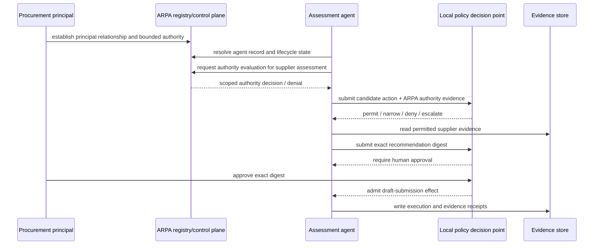

# Worked scenario: governed supplier-assessment agent through ARPA

This scenario demonstrates one optional implementation of the guide's discovery and authority-control planes using the Agent Registry Protocol (ARPA). It does **not** make ARPA mandatory for the guide.

## Job

For a procurement principal, assess a named supplier using approved evidence sources, prepare a recommendation, and submit the recommendation for human approval. The agent may read the permitted supplier evidence and write a draft assessment. It may not execute a purchase, sign a contract, change supplier master data, or transmit confidential evidence outside the approved domain.

## Control-plane flow



## Mapping

| Guide concern | ARPA realization | Evidence expected |
|---|---|---|
| persistent agent identity | ARPA-Core | resolved record + lifecycle/freshness state |
| principal relationship | ARPA-Relations | typed relationship with competent issuer/context |
| bounded assessment authority | ARPA-Authority | authority envelope / decision receipt |
| capability claim | ARPA-Assurance | scoped capability evidence, if required by policy |
| consequential-action reconstruction | ARPA-Evidence | execution receipt and retained references |
| foreign registry recognition | ARPA-Federation, when applicable | recognition decision and withdrawal state |
| final local effect admission | local policy/enforcement plane | policy decision and exact-action approval evidence |

## Two independent gates

ARPA authority resolution answers whether the agent has a legitimate request surface under the registry/control-plane state. It does **not** oblige the local procurement system to execute the request.

The local policy gate separately evaluates organizational policy, risk, approvals, data restrictions, and exact effect parameters.

Therefore:

```text
ARPA authority decision + local policy admission + exact capability/enforcement
    -> consequential effect may proceed
```

No single earlier step implies the final result.

## Required negative tests

The machine-readable companion vector is `examples/arpa-authority-negative-tests.yaml`.

| Test | Expected result | Invariant |
|---|---|---|
| registered agent has no authority envelope | DENY | registration != authority |
| authority expired | DENY | current state required |
| authority revoked | DENY | revoked authority cannot admit effect |
| delegated scope broader than parent | DENY | downstream authority cannot expand |
| local cache predates material revocation | DENY or ESCALATE | stale state cannot silently authorize |
| foreign registry technically reachable but unrecognized | DENY | federation != governance recognition |
| agent has supplier-analysis capability but no mandate | DENY | capability != permission |
| human approved digest differs from execution digest | DENY | approval binds exact action |
| execution succeeded despite missing authority evidence | GOVERNANCE FAILURE | successful execution != legitimate effect |

## Evidence bundle

A reviewable bundle should contain at least:

1. resolved ARPA agent record and lifecycle/freshness evidence;
2. principal/relationship evidence;
3. authority evaluation result and applicable scope;
4. capability/assurance evidence where policy requires it;
5. local policy decision;
6. exact action digest and approval evidence;
7. execution receipt;
8. revocation/status references used during admission;
9. challenge/remediation route.

## Assurance claim

Passing this scenario demonstrates that one implementation preserves the TGA/ARPA architectural boundary for this bounded job. It does not establish general ARPA conformance, external certification, or universal suitability for agentic systems.
