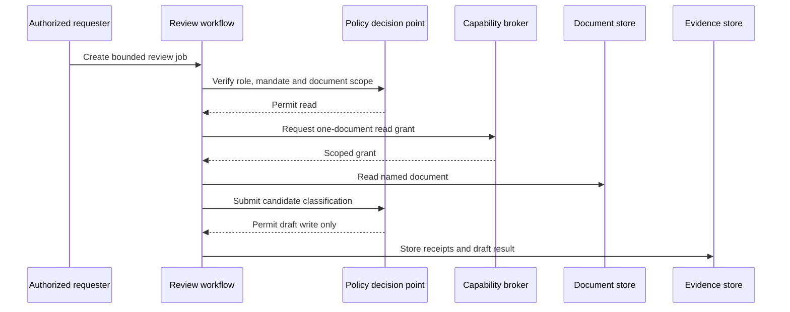

# Single-Agent Bounded Record Review

## Job

Review one named internal policy document and produce a non-binding classification and summary. The system may read only the named document and write only a draft review record.

## Authority and effects

| Effect | Authority | Capability |
|---|---|---|
| read policy document | review mandate, named resource | read-only, one-document grant |
| write draft classification | review mandate | draft-record write grant |
| publish final classification | prohibited | no capability issued |

## Sequence

## Negative demonstrations

- request for a second document is denied;
- attempt to publish is denied;
- expired mandate prevents draft write;
- altered candidate-action digest invalidates approval.
