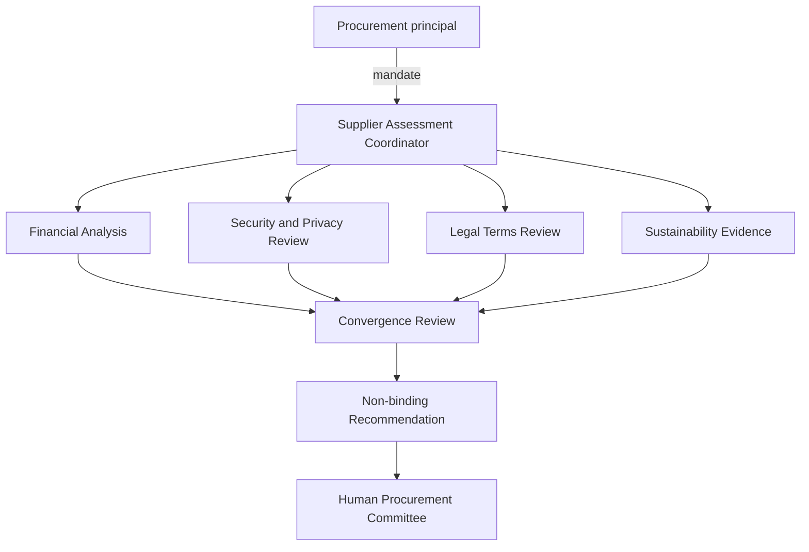

# Multi-Agent Supplier Assessment

## Job definition

Assess one named supplier and produce a non-binding recommendation for a human procurement committee. No agent may sign, purchase, commit funds, or communicate acceptance to the supplier.

| Dimension | Definition |
|---|---|
| Principal | Enterprise procurement function |
| Coordinator role | Supplier Assessment Coordinator |
| Outcome | Signed recommendation with evidence, confidence, dissent, and unresolved risks |
| Non-outcomes | contract, purchase order, payment, supplier commitment |
| Completion | recommendation stored, bundle complete, committee notified, temporary capabilities revoked |

## Topology

## Authority allocation

| Role | Authority | Capability | Prohibited effect |
|---|---|---|---|
| Coordinator | delegate bounded analyses; compose recommendation | create branch tasks; read branch outputs; write draft | bind enterprise or commit funds |
| Financial | evaluate named evidence | read specified reports; bounded calculations | unrelated data or supplier contact |
| Security | assess supplied control evidence | read attestations; query approved catalog | production-system access |
| Legal | identify deviations | read draft and clause library | accept or alter terms |
| Sustainability | assess named evidence | read disclosures and approved public sources | issue public claim |
| Convergence | compare results | read receipts; write candidate recommendation | commercial action |

## Execution sequence

1. Create a job bound to supplier, purpose, risk tier, and deadline.
2. Verify coordinator mandate and status.
3. Issue four child delegations with distinct scopes and expiry.
4. Issue branch-specific read and compute capabilities.
5. Require structured branch results and receipts.
6. Verify branch lineage, evidence, and dissent.
7. Run aggregate-authority and prohibited-inference checks.
8. Create candidate recommendation.
9. Permit recommendation write while denying commercial commitment.
10. close evidence bundle and revoke temporary capabilities.
11. expose challenge route allowing one branch to rerun without reopening unrelated authority.

## Failure injections

| Failure | Expected control |
|---|---|
| Financial branch requests unrelated raw records | broker denies resource expansion |
| Legal branch attempts to delegate contract acceptance | lineage verifier rejects scope expansion |
| Security evidence expires | effect admission pauses for re-verification |
| Harmless branch fields combine into prohibited profile | convergence gate blocks aggregate disclosure |
| Coordinator mandate is revoked | propagation interrupts branches and final write |
| Purpose changes from assessment to negotiation | new mandate or amendment required |

## Evidence bundle

Root mandate, four hop records, four capability grants, four execution receipts, evidence references, confidence and dissent, convergence result, policy decision, final execution receipt, revocation receipts, retention policy, and challenge endpoint.
