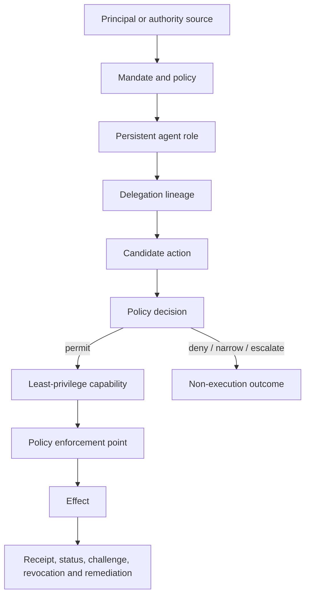
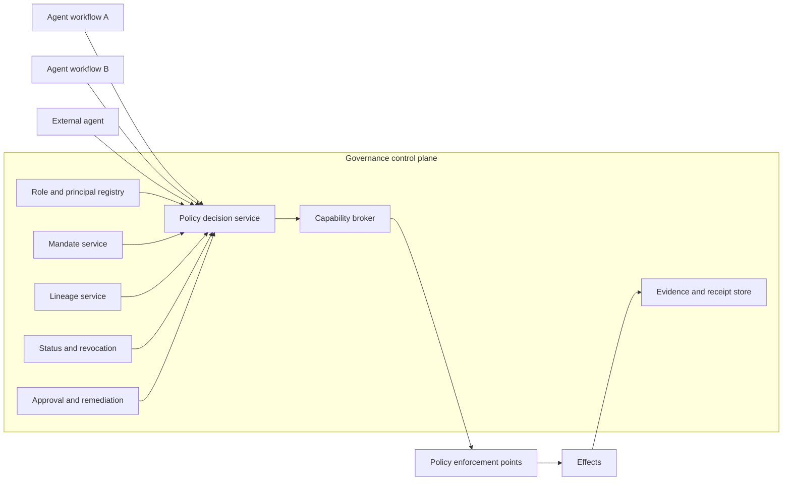

# Implementation Guide

## 1. How to use this playbook

Use this guide to deliver one bounded job from discovery through production readiness. Do not begin by selecting a model, agent framework, or tool protocol. Begin with the effects the job may produce and work backward to authority, controls, evidence, and execution.

For every stage:

1. Confirm the entry criteria.
2. Make the listed architecture decisions.
3. Produce the required artifacts using the linked templates.
4. map the design to TSMM, TGA, and TIS.
5. implement positive and negative tests.
6. retain the evidence required by the exit gate.
7. record material choices in an Architecture Decision Record.

A stage is complete only when its exit evidence exists. Code completion alone is not a governance gate.

## 2. Governing model: effect admission

A production agentic system is an authority-bearing system capable of changing the world. The primary question is not how autonomous the agent is. The primary question is whether a specific effect may be admitted.



### 2.1 Five objects that must remain distinct

| Object | Question answered | Failure if collapsed |
|---|---|---|
| Identity | Who or what is participating? | Authentication is mistaken for authority. |
| Authority | What may legitimately be done, for whom, and why? | Role membership or tool possession becomes presumed permission. |
| Capability | What can technically be done now? | Broad credentials create excessive blast radius. |
| Decision | What does the governed workflow conclude should happen? | Model output is mistaken for approved action. |
| Execution or effect | What actually happened? | Intent and outcome cannot be reconciled, challenged, or remediated. |

### 2.2 Two independent admission gates

| Gate | Question | Outcomes |
|---|---|---|
| Delegation assurance | Is the requester authentic, authorized, in scope, current, unrevoked, and connected to an intact lineage? | pass, fail, indeterminate, escalate |
| Local policy admission | May this receiving system cooperate under its policies, approvals, agreements, data limits, and risk constraints? | accept, narrow, request evidence, request approval, refuse, escalate |

A valid delegation creates a legitimate request surface. It does not create an obligation to comply.

## 3. Reference architecture



### 3.1 Component contracts

| Component | Required inputs | Required outputs | Mandatory deny or safe-state conditions |
|---|---|---|---|
| Role registry | role reference, principal context, requested status | resolved role, principal, lifecycle state | unknown role; unresolved principal; suspended role |
| Mandate service | mandate reference, action context, time | mandate state and verification receipt | expired, revoked, wrong purpose, prohibited effect |
| Lineage service | lineage root, hop chain, action context | verification result and failed invariants | missing parent, principal substitution, scope expansion, stale status |
| Policy decision point | candidate action, mandate, lineage, evidence, approvals | permit, deny, narrow, or escalate decision | incomplete evidence, conflicting policy, unknown risk state |
| Capability broker | permitted action digest, resource, operation, bounds | scoped grant or denial receipt | request exceeds decision, missing binding, unavailable revocation |
| Enforcement point | grant, target resource, exact operation | execution event or denial | invalid signature, expired grant, parameter mismatch, replay |
| Evidence store | signed events, references, custody metadata | append-only bundle and authorized views | missing provenance, broken digest, retention conflict |
| Revocation service | revocation authority, affected scope, lineage graph | status event and propagation evidence | unauthorised revoker, ambiguous target, unknown descendants |

## 4. Stage 0 — Define the bounded job and effects

### Objective

Select one valuable job with an observable completion state and explicitly bounded effects.

### Entry criteria

- a named business owner exists;
- the desired outcome can be described without naming an AI model;
- a human or institutional fallback process is known;
- the system boundary can be drawn.

### Procedure

1. Write a one-sentence job statement using: **For [principal], produce [outcome] using [permitted information] without [prohibited effects].**
2. Identify every externally observable effect, including reads, writes, messages, commitments, disclosures, and agent creation.
3. Classify each effect by consequence, reversibility, affected parties, and required approval.
4. Define explicit non-outcomes and forbidden transitions.
5. Define completion, timeout, cancellation, and fallback states.
6. Build the effect-admission matrix.
7. Review the matrix with the job owner, security owner, and governance owner.

### Required outputs

- [job charter]();
- [effect-admission matrix]();
- system boundary diagram;
- effect catalog and risk tier;
- definition of done and non-outcomes.

### Repository mapping

- **TSMM:** effect, decision, actor, policy, evidence, lifecycle.
- **TGA:** quickstart, governance profiles, effect-oriented packages.
- **TIS:** later schema targets are identified, but no implementation schema is selected yet.

### Tests

- every consequential external effect is named;
- no effect is hidden inside a generic label such as “complete task”;
- each effect has permit, deny, and escalation behavior;
- prohibited effects are testable;
- the job remains understandable after removing model and vendor names.

### Evidence produced

Approved job charter, effect catalog, risk rationale, decision log, and stakeholder sign-off.

### Common failure modes

- beginning from a chatbot persona rather than a job;
- classifying only writes as effects and ignoring sensitive reads;
- treating “recommend” and “commit” as the same authority class;
- failing to define partial completion or cancellation.

### Exit gate

The team can state exactly what the system may change, what it may not change, and what evidence is required before every consequential effect.

## 5. Stage 1 — Model principals, roles, and authority

### Objective

Identify who is represented, which persistent roles participate, where authority originates, and which actors rely on the result.

### Entry criteria

- Stage 0 effect catalog is approved;
- business ownership and fallback process are known.

### Procedure

1. List principals, authority sources, beneficiaries, operators, relying parties, and affected parties.
2. Define persistent agent roles independently of model sessions or runtime processes.
3. Assign each effect to a role that may propose it and a role or service that may admit it.
4. Map authority-source relationships and delegation boundaries.
5. Identify trust-domain boundaries and external dependencies.
6. Record lifecycle owners for role creation, suspension, replacement, and retirement.
7. Create a TSMM instance model and role catalog.

### Required outputs

- principal and authority-source map;
- role catalog;
- TSMM instance model;
- trust-domain map;
- role lifecycle and accountability matrix.

### Tests

- no role is self-authorizing;
- every consequential role resolves to a principal or recognized authority source;
- persistent role and ephemeral workload instance are distinct;
- every relying party knows which evidence it may verify;
- responsibility remains identifiable after model replacement.

### Exit gate

Every proposed effect can be attributed to a persistent role, a principal, and an authority source.

## 6. Stage 2 — Define mandates and policy boundaries

### Objective

Turn authority into machine-readable, reviewable, and revocable operating boundaries before granting tool access.

### Procedure

1. Create a mandate for each consequential role.
2. Bind the mandate to purpose, effects, resources, duration, value limits, and risk thresholds.
3. Define prohibited actions explicitly rather than relying only on allow lists.
4. Set delegation depth, subdelegation rights, approval thresholds, and escalation triggers.
5. Identify revocation authority and status endpoints.
6. Define amendment and renewal rules.
7. produce valid, expired, revoked, wrong-purpose, and excessive-scope fixtures.
8. validate the authority boundary against applicable TIS schemas.

### Required outputs

- machine-readable mandate;
- policy rules and approval matrix;
- mandate status endpoint contract;
- positive and negative fixtures;
- [mandate template]().

### Mandatory tests

- expired and revoked mandates fail;
- action outside purpose fails;
- prohibited effect fails even when technically available;
- value threshold routes to approval;
- amendment is distinguishable from refresh;
- absent or ambiguous mandate produces a safe state.

### Exit gate

No consequential effect can be admitted without a current mandate and an applicable policy result.

## 7. Stage 3 — Design delegation and lineage

### Objective

Make authority transfer reconstructable and machine-verifiable before implementing agent-to-agent routing.

### Procedure

1. Select direct, chained, fan-out, cross-domain, or combined topology.
2. Define the lineage root, originating principal, original intent, and transaction binding.
3. Define required hop fields and parent-hop references.
4. Define the scope comparison function and monotonic attenuation rule.
5. Define trust-domain translation evidence.
6. Define status freshness, refresh, and revocation propagation rules.
7. Create valid and invalid lineage examples.
8. Implement a verifier that returns invariant-level results rather than a single boolean.

### Delegation invariant

For every non-root hop, granted authority must be equal to or narrower than authority received from the parent. A broader grant is a new authorization event, not valid subdelegation.

### Required outputs

- topology diagram;
- [delegation-hop record]();
- lineage verifier and result format;
- translation record;
- negative fixture corpus.

### Mandatory negative tests

- missing intermediate hop;
- principal substitution;
- scope expansion;
- transaction mismatch;
- stale or revoked parent;
- refresh that changes purpose;
- translation that broadens authority;
- revocation reaching only some descendants.

### Exit gate

The complete authority path to every executing workload is reconstructable and machine-verifiable.

## 8. Stage 4 — Separate authority from capability

### Objective

Issue technical power only after authority and policy checks and make the grant as narrow as practical.

### Procedure

1. Inventory consequential tools, APIs, data stores, signing functions, and messaging channels.
2. place each behind a policy enforcement point.
3. define capability operations, resource boundaries, parameters, duration, purpose, transferability, and revocation.
4. bind every capability request to the candidate-action digest and policy decision.
5. issue short-lived grants from a capability broker.
6. isolate secrets from model and orchestration contexts.
7. emit grant and denial receipts.
8. test replay, parameter substitution, and direct-tool bypass.

### Capability broker contract

**Inputs:** role, mandate verification, lineage verification, action digest, operation, resource, parameters, requested duration.

**Outputs:** scoped capability grant, denial reason, or escalation requirement.

**MUST deny when:** mandate is stale; lineage is incomplete; operation exceeds authority; resource is outside scope; approval is absent; action digest differs; revocation cannot be enforced for the risk class.

### Required outputs

- capability broker service boundary;
- [capability grant template]();
- enforcement map;
- secrets isolation design;
- grant and denial receipts.

### Exit gate

No workload can reach a consequential resource except through a validated capability and enforcement point.

## 9. Stage 5 — Build the governed execution workflow

### Objective

Treat model output as a candidate action, validate it, and separate policy decision from execution.

### Procedure

1. Define a structured candidate-action schema for each effect class.
2. Require exact evidence references, uncertainty, requested capability, and approval state.
3. validate shape, semantic completeness, and evidence availability.
4. evaluate mandate, lineage, local policy, risk, and approvals.
5. bind approval to the exact action digest.
6. request a capability only after a permit decision.
7. execute through the enforcement point.
8. record deny, narrow, retry, timeout, and escalation outcomes.
9. cap retry loops and prevent the model from altering policy state.

### Required outputs

- [candidate action template]();
- policy decision state machine;
- human-review packet;
- refusal and escalation format;
- exact action digesting rules.

### Mandatory tests

- prompt injection cannot invoke tools directly;
- malformed candidate action fails;
- missing evidence fails or escalates;
- human approval cannot be reused for a changed action;
- model cannot mark its own action approved;
- retries cannot silently broaden purpose or scope.

### Exit gate

A model can propose an effect but cannot unilaterally produce it.

## 10. Stage 6 — Govern fan-out, convergence, and return review

### Objective

Govern each branch and the combined result when several agents, tools, or reasoning passes contribute to one job.

### Procedure

1. define one bounded subtask per branch.
2. issue distinct delegated scope, data, capability, and expiry to each branch.
3. record branch manifests and lineage.
4. require structured results, evidence, confidence, limitations, and dissent.
5. verify each branch independently.
6. perform aggregate-authority, aggregate-data, prohibited-inference, and conflict checks.
7. preserve material dissent rather than reducing review to majority voting.
8. create a convergence receipt before final effect admission.

### Required outputs

- [branch manifest]();
- convergence policy;
- [convergence review]();
- dissent record;
- aggregate-effect test cases.

### Critical rule

Individual branch validity does not prove aggregate validity. Combined outputs may exceed parent authority, disclose prohibited information, or create an impermissible inference.

### Exit gate

The initiating workflow can prove what was delegated, returned, reviewed, accepted, rejected, or escalated.

## 11. Stage 7 — Produce evidence and receipts

### Objective

Make governance evidence a first-class runtime product, not a reconstruction from logs.

### Procedure

1. define receipt types and stable identifiers.
2. bind receipts to job, action, role, mandate, lineage, policy, capability, and effect.
3. sign or otherwise protect integrity and attribution.
4. add reliable time and lifecycle status.
5. define evidence custody, availability, retention, and selective-disclosure views.
6. define challenge access and redaction rules.
7. assemble an end-to-end evidence bundle.
8. test independent reconstruction without model memory.

### Minimum receipt chain

```text
mandate verification
  → lineage verification
  → policy decision
  → capability grant
  → execution receipt
  → status, challenge, revocation and remediation records
```

### Required outputs

- receipt catalog;
- [execution receipt template]();
- evidence bundle manifest;
- custody and disclosure policy;
- independent verification procedure.

### Exit gate

Every consequential effect has a portable evidence bundle and a discoverable challenge route.

## 12. Stage 8 — Implement revocation, interruption, and remediation

### Objective

Treat revocation as a graph operation and operational workflow rather than token expiry.

### Procedure

1. identify who may revoke which authority.
2. define granular scopes and affected descendants.
3. define propagation latency by risk tier.
4. implement status events and descendant discovery.
5. add interruption hooks for in-flight work.
6. define safe behavior when propagation state is unknown.
7. define remediation for completed or irreversible effects.
8. require downstream acknowledgements and evidence.
9. exercise revocation in a live integration test.

### Required outputs

- revocation state machine;
- [revocation event]();
- propagation service;
- interruption hooks;
- [remediation record]();
- risk-tier runbooks.

### Mandatory tests

- root revocation reaches all known descendants;
- branch-specific revocation does not disable unrelated authority;
- in-flight execution is interrupted where possible;
- unknown descendant state causes suspension;
- completed effects route to compensation or remediation;
- refresh cannot revive revoked authority.

### Exit gate

The team can demonstrate prevention, interruption, and remediation with verifiable evidence.

## 13. Stage 9 — Operationalize assurance

### Objective

Keep implementation, semantic model, schemas, documentation, controls, and evidence aligned as the system evolves.

### Procedure

1. select a conformance target and risk profile.
2. pin TSMM, TIS, and TGA revisions in the architecture baseline.
3. run schema, semantic-invariant, policy, integration, adversarial, and lifecycle tests in CI.
4. assign control and evidence ownership.
5. define operational metrics and service objectives.
6. run evidence-reconstruction and revocation exercises.
7. review changes affecting authority, evidence, interoperability, or lifecycle semantics.
8. publish release evidence and migration notes.

### Required outputs

- conformance profile;
- CI gates;
- ADR set;
- control ownership matrix;
- assurance dashboard;
- production-readiness review;
- release evidence bundle.

### Exit gate

The system can evolve without silently changing authority, evidence, or interoperability semantics.

## 14. Delivery plan for architects and consultants

| Work package | Primary deliverables | Acceptance evidence |
|---|---|---|
| WP1 — Job and effect definition | job charter, effect catalog, system boundary | approved effect-admission matrix |
| WP2 — Authority architecture | role catalog, principal map, mandates, revocation model | TSMM instance and mandate tests |
| WP3 — Delegation and capability | topology, lineage records, broker and enforcement design | TIS-valid examples and negative tests |
| WP4 — Governed workflow | candidate actions, policy state machine, fan-out and convergence | end-to-end job demonstration |
| WP5 — Evidence and assurance | receipts, bundle, authorized views, challenge and remediation | independent reconstruction report |
| WP6 — Operational adoption | CI, ADRs, runbooks, training, metrics | production-readiness approval |

## 15. Definition of a working governed job

A job is implementation-ready when:

- its effects and non-effects are explicit;
- every role resolves to authority;
- every consequential action requires a current mandate;
- every delegation has verifiable lineage and attenuation;
- every capability is mediated and narrower than supporting authority;
- model output is validated before execution;
- fan-out is checked individually and collectively;
- evidence supports independent reconstruction;
- revocation, interruption, and remediation are demonstrated;
- operational ownership and assurance gates are assigned.
